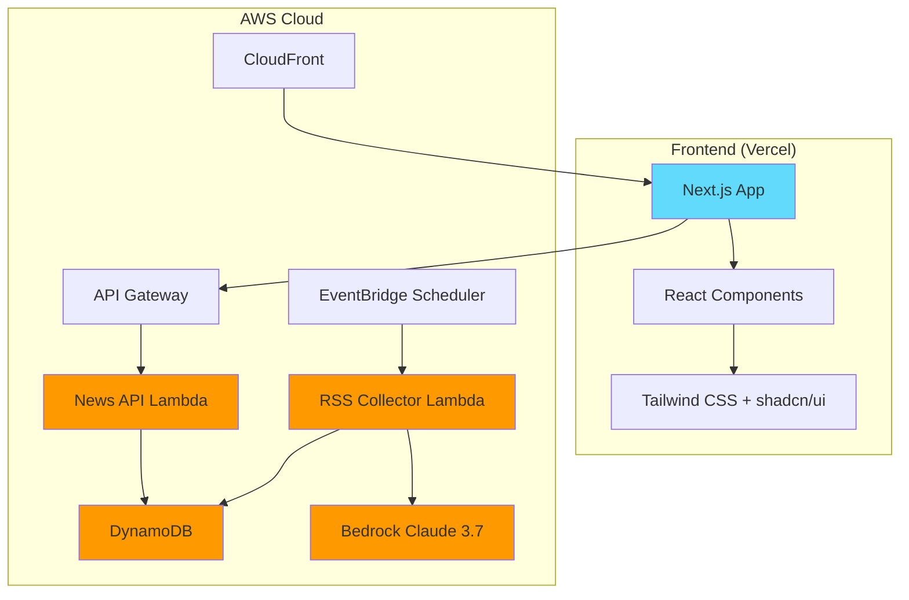

# AWS News Service

AWS RSS 피드를 수집하여 AI 번역 및 요약 기능을 제공하는 서버리스 뉴스 서비스

## 📋 프로젝트 개요

AWS 공식 RSS 피드를 자동으로 수집하고, AWS Bedrock의 Claude 3.7 Sonnet을 활용하여 한국어 번역 및 요약을 제공하는 뉴스 서비스입니다.

## 🏗️ 아키텍처



## 🛠️ 기술 스택

### Frontend
- **Framework**: Next.js 14 (App Router)
- **Language**: TypeScript
- **Styling**: Tailwind CSS + shadcn/ui
- **Deployment**: Vercel

### Backend
- **Runtime**: Node.js 20.x
- **Language**: TypeScript
- **Infrastructure**: AWS SAM
- **Services**: Lambda, DynamoDB, EventBridge, Bedrock

### AI Services
- **Model**: AWS Bedrock Claude 3.7 Sonnet
- **Features**: 번역, 요약, 카테고리 분류

## 📁 프로젝트 구조

```
aws-news/
├── backend/           # 서버리스 백엔드 (AWS SAM)
├── frontend/          # Next.js 프론트엔드
├── infrastructure/    # 인프라 배포 스크립트
└── .amazonq/         # Amazon Q 프로젝트 규칙
```

## 🚀 빠른 시작

### 1. 저장소 클론
```bash
git clone <repository-url>
cd aws-news
```

### 2. 백엔드 배포
```bash
cd backend
npm install
sam build
sam deploy --guided
```

### 3. 프론트엔드 실행
```bash
cd frontend
npm install
npm run dev
```

## 📊 주요 기능

- **자동 RSS 수집**: 1시간마다 AWS 뉴스 피드 수집
- **AI 번역**: 영문 기사를 한국어로 자동 번역
- **AI 요약**: 긴 기사를 간결하게 요약
- **카테고리 분류**: AI 기반 자동 카테고리 분류
- **반응형 UI**: 모바일 퍼스트 디자인
- **무한 스크롤**: 성능 최적화된 기사 로딩

## 🔧 환경 설정

### Backend 환경변수
```bash
ARTICLES_TABLE=aws-news-articles
AWS_REGION=ap-northeast-2
```

### Frontend 환경변수
```bash
NEXT_PUBLIC_API_URL=https://your-api-gateway-url
```

## 📈 성능 최적화

- **Lambda Cold Start 최소화**: 적절한 메모리 할당 (1GB)
- **DynamoDB 최적화**: GSI를 통한 효율적인 쿼리
- **CDN 캐싱**: CloudFront를 통한 정적 자산 캐싱
- **이미지 최적화**: Next.js Image 컴포넌트 활용

## 🔒 보안

- **IAM 최소 권한**: 각 Lambda 함수별 최소 권한 부여
- **API Rate Limiting**: API Gateway 레벨에서 요청 제한
- **CORS 정책**: 엄격한 CORS 설정
- **데이터 암호화**: DynamoDB 암호화 저장

## 📝 라이선스

MIT License

## 🤝 기여하기

1. Fork the Project
2. Create your Feature Branch (`git checkout -b feature/AmazingFeature`)
3. Commit your Changes (`git commit -m 'Add some AmazingFeature'`)
4. Push to the Branch (`git push origin feature/AmazingFeature`)
5. Open a Pull Request

## 📞 문의

프로젝트 관련 문의사항이 있으시면 이슈를 생성해 주세요.