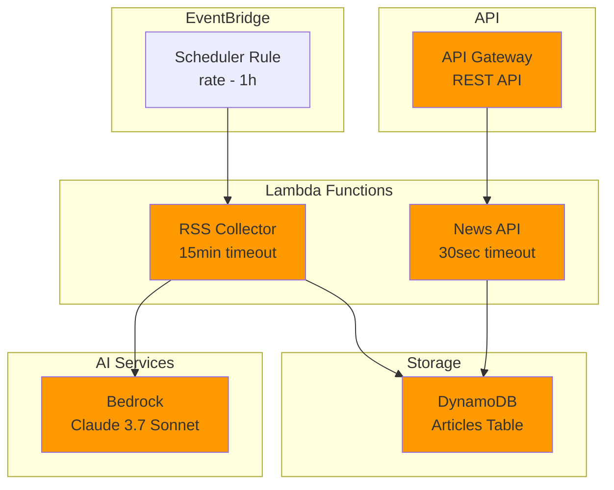
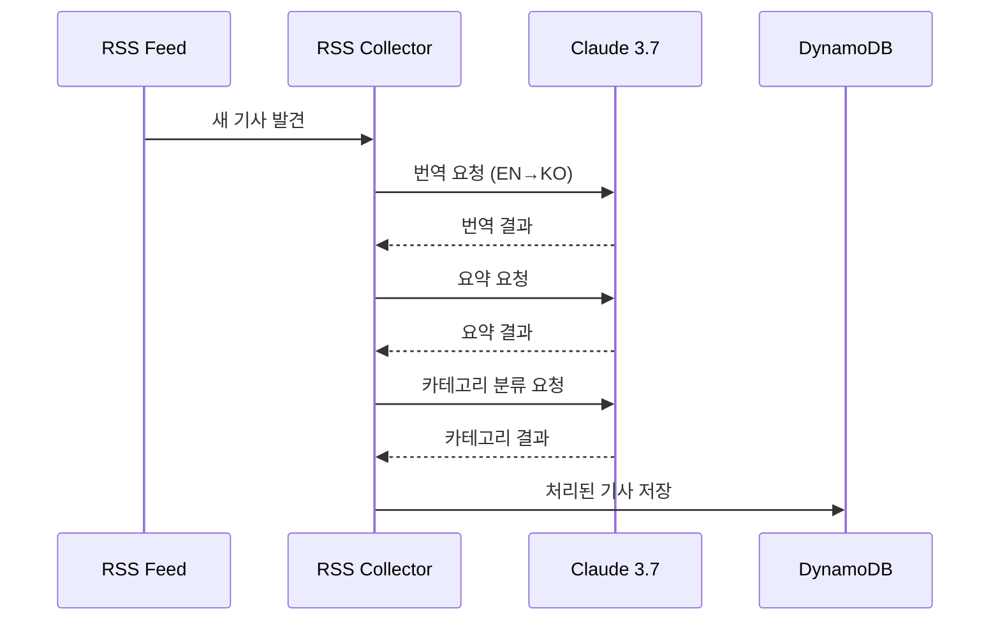

# AWS News Service - Backend (Unofficial)

**⚠️ AWS 비공식 프로젝트**

서버리스 아키텍처 기반의 AWS 공개 RSS 피드 수집 및 처리 백엔드

## 🏗️ 아키텍처



## 📁 프로젝트 구조

```
backend/
├── src/
│   ├── rss-collector/     # RSS 수집 Lambda
│   ├── news-api/          # REST API Lambda
│   ├── ai-processor/      # AI 처리 Lambda (미사용)
│   └── types/             # TypeScript 타입 정의
├── template.yaml          # SAM 템플릿
├── samconfig.toml         # SAM 설정
└── package.json           # 의존성 관리
```

## 🚀 배포 가이드

### 1. 사전 요구사항
- AWS CLI 설치 및 구성
- SAM CLI 설치
- Node.js 20.x

### 2. 의존성 설치
```bash
npm install
```

### 3. 빌드
```bash
sam build
```

### 4. 배포
```bash
# 첫 배포 시
sam deploy --guided

# 이후 배포
sam deploy
```

## 🔧 Lambda 함수

### RSS Collector Function
- **트리거**: EventBridge (1시간마다)
- **타임아웃**: 15분
- **메모리**: 1GB
- **기능**: RSS 피드 수집, AI 번역/요약, DynamoDB 저장

### News API Function
- **트리거**: API Gateway
- **타임아웃**: 30초
- **메모리**: 512MB
- **엔드포인트**:
  - `GET /articles` - 기사 목록 조회
  - `GET /articles/{id}` - 특정 기사 조회
  - `GET /services` - AWS 서비스 목록 조회

## 📊 DynamoDB 스키마

### Articles Table
```typescript
interface Article {
  id: string;                    // Primary Key
  title: string;                 // 번역된 제목
  originalTitle: string;         // 원본 제목
  content: string;               // 번역된 내용
  originalContent: string;       // 원본 내용
  summary: string;               // AI 요약
  originalSummary: string;       // 원본 요약
  link: string;                  // 원본 링크
  publishedAt: string;           // 발행일 (ISO 8601)
  category: string;              // 카테고리
  tags: string[];                // 태그 배열
  language: 'ko' | 'en';         // 언어
  awsServices?: string[];        // AWS 서비스 목록
}
```

### GSI (Global Secondary Index)
- **Index Name**: `category-publishedAt-index`
- **Partition Key**: `category`
- **Sort Key**: `publishedAt`

## 🤖 AI 처리 워크플로우



## 🔧 로컬 개발

### SAM Local 실행
```bash
sam local start-api
```

### 개별 함수 테스트
```bash
# RSS Collector 테스트
node local-rss-collector.cjs

# API 테스트
curl http://localhost:3000/articles
```

## 📈 모니터링

### CloudWatch 메트릭
- Lambda 실행 시간
- DynamoDB 읽기/쓰기 용량
- API Gateway 요청 수
- Bedrock 모델 호출 수

### 로그 확인
```bash
sam logs -n RSSCollectorFunction --tail
sam logs -n NewsAPIFunction --tail
```

## 🔒 보안 설정

### IAM 권한
- **RSS Collector**: DynamoDB 읽기/쓰기, Bedrock 모델 호출
- **News API**: DynamoDB 읽기 전용

### 환경변수
```yaml
Environment:
  Variables:
    ARTICLES_TABLE: !Ref ArticlesTable
```

## 🚨 트러블슈팅

### 일반적인 문제
1. **Lambda 타임아웃**: RSS 수집 시 대량 데이터 처리로 인한 타임아웃
2. **Bedrock 제한**: 모델 호출 제한 초과
3. **DynamoDB 스로틀링**: 쓰기 용량 초과

### 해결 방법
- 배치 처리 크기 조정
- 재시도 로직 구현
- DynamoDB Auto Scaling 활성화

## 📊 비용 최적화

- **On-Demand 빌링**: DynamoDB 사용량 기반 과금
- **Lambda 최적화**: 적절한 메모리 할당으로 비용 효율성
- **Bedrock 사용량 모니터링**: AI 모델 호출 최적화