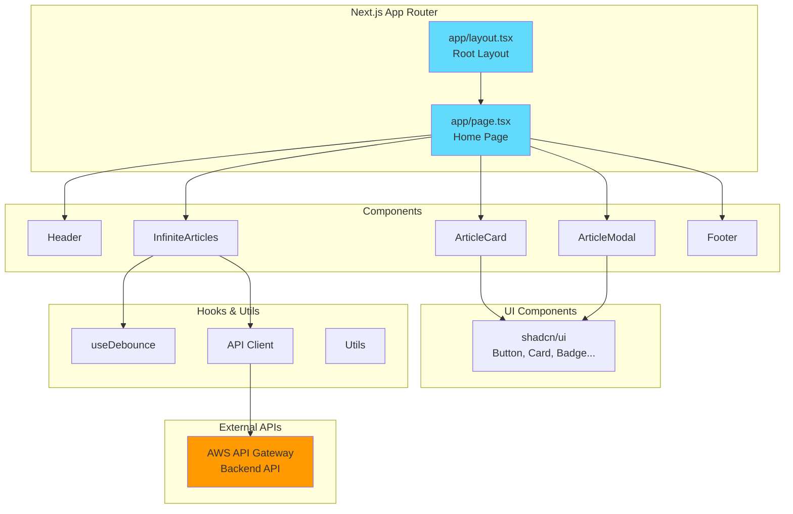

# AWS News Service - Frontend (Unofficial)

**⚠️ AWS 비공식 프로젝트**

Next.js 14 기반의 AWS 뉴스 비공식 웹 애플리케이션

## 🎨 기술 스택

- **Framework**: Next.js 14 (App Router)
- **Language**: TypeScript
- **Styling**: Tailwind CSS + shadcn/ui
- **State Management**: React Hooks
- **Deployment**: S3 + CloudFront
- **Icons**: Lucide React

## 🏗️ 아키텍처



## 📁 프로젝트 구조

```
frontend/
├── src/
│   ├── app/                   # Next.js App Router
│   │   ├── layout.tsx         # 루트 레이아웃
│   │   ├── page.tsx           # 홈 페이지
│   │   └── globals.css        # 글로벌 스타일
│   ├── components/            # React 컴포넌트
│   │   ├── ui/                # shadcn/ui 컴포넌트
│   │   ├── article-card.tsx   # 기사 카드
│   │   ├── article-modal.tsx  # 기사 상세 모달
│   │   ├── header.tsx         # 헤더
│   │   ├── footer.tsx         # 푸터
│   │   └── infinite-articles.tsx # 무한 스크롤
│   ├── hooks/                 # 커스텀 훅
│   │   └── use-debounce.ts    # 디바운스 훅
│   ├── lib/                   # 유틸리티
│   │   ├── api.ts             # API 클라이언트
│   │   └── utils.ts           # 공통 유틸
│   └── types/                 # TypeScript 타입
│       └── article.ts         # 기사 타입 정의
├── public/                    # 정적 자산
├── next.config.js             # Next.js 설정
└── tailwind.config.js         # Tailwind 설정
```

## 🚀 개발 가이드

### 1. 의존성 설치
```bash
npm install
```

### 2. 환경변수 설정
```bash
# .env.local 파일 생성
NEXT_PUBLIC_API_URL=https://your-api-gateway-url
```

### 3. 개발 서버 실행
```bash
npm run dev
```

### 4. 빌드 및 배포
```bash
# 빌드
npm run build

# 로컬 실행
npm start

# Vercel 배포
npm run deploy
```

## 🎯 주요 기능

### 1. 기사 목록 표시
- 무한 스크롤로 성능 최적화
- 카테고리별 필터링
- 검색 기능 (디바운스 적용)
- 반응형 그리드 레이아웃

### 2. 기사 상세 보기
- 모달 기반 상세 보기
- 원문/번역문 토글
- 요약 정보 표시
- AWS 서비스 태그

### 3. 사용자 경험
- 로딩 스켈레톤
- 에러 바운더리
- 접근성 최적화
- 모바일 퍼스트 디자인

## 🎨 UI 컴포넌트

### shadcn/ui 컴포넌트
```typescript
// 사용 중인 컴포넌트
- Button
- Card (CardHeader, CardContent, CardFooter)
- Badge
- Input
- Separator
- Skeleton
```

### 커스텀 컴포넌트
```typescript
// ArticleCard - 기사 카드 컴포넌트
interface ArticleCardProps {
  article: Article;
  onClick: (article: Article) => void;
}

// InfiniteArticles - 무한 스크롤 컴포넌트
interface InfiniteArticlesProps {
  searchQuery: string;
  selectedCategory: string;
}
```

## 🔧 API 통신

### API 클라이언트
```typescript
// lib/api.ts
export const api = {
  getArticles: (params: GetArticlesParams) => Promise<ArticlesResponse>,
  getArticle: (id: string) => Promise<Article>,
  getServices: () => Promise<string[]>
};
```

### 데이터 페칭 패턴
- Server Components에서 초기 데이터 로드
- Client Components에서 인터랙티브 기능
- SWR 패턴으로 캐싱 및 재검증

## 📱 반응형 디자인

### 브레이크포인트
```css
/* Tailwind CSS 브레이크포인트 */
sm: 640px   /* 모바일 */
md: 768px   /* 태블릿 */
lg: 1024px  /* 데스크톱 */
xl: 1280px  /* 대형 데스크톱 */
```

### 그리드 시스템
```typescript
// 반응형 그리드
<div className="grid grid-cols-1 md:grid-cols-2 lg:grid-cols-3 gap-6">
  {articles.map(article => (
    <ArticleCard key={article.id} article={article} />
  ))}
</div>
```

## 🎭 상태 관리

### React Hooks 패턴
```typescript
// 로컬 상태 관리
const [articles, setArticles] = useState<Article[]>([]);
const [loading, setLoading] = useState(false);
const [searchQuery, setSearchQuery] = useState('');

// 커스텀 훅 활용
const debouncedSearchQuery = useDebounce(searchQuery, 300);
```

## 🔍 검색 및 필터링

### 검색 기능
- 실시간 검색 (디바운스 적용)
- 제목, 내용, 태그 검색
- 검색어 하이라이팅

### 필터링
- 카테고리별 필터
- 날짜 범위 필터
- AWS 서비스별 필터

## 📈 성능 최적화

### Next.js 최적화
- App Router 활용
- Server Components 우선 사용
- 이미지 최적화 (next/image)
- 폰트 최적화 (next/font)

### 런타임 최적화
- 무한 스크롤로 초기 로딩 시간 단축
- 디바운스로 API 호출 최적화
- 메모이제이션 (useMemo, useCallback)

## 🚨 에러 처리

### 에러 바운더리
```typescript
// 전역 에러 처리
export default function GlobalError({
  error,
  reset,
}: {
  error: Error & { digest?: string }
  reset: () => void
}) {
  return (
    <div className="flex flex-col items-center justify-center min-h-screen">
      <h2>문제가 발생했습니다!</h2>
      <button onClick={() => reset()}>다시 시도</button>
    </div>
  )
}
```

## 🔒 보안

### 환경변수 관리
- 클라이언트 사이드: `NEXT_PUBLIC_` 접두사
- 서버 사이드: 일반 환경변수

### CORS 정책
- API Gateway에서 CORS 설정
- 허용된 도메인만 접근 가능

## 📊 배포 전략

### S3 + CloudFront 배포
```bash
# 빌드 및 배포
npm run build
npm run deploy

# 수동 배포
aws s3 sync out/ s3://aws-news.drumgoon.net-static --delete
aws cloudfront create-invalidation --distribution-id E1E7R090QDM174 --paths "/*"
```

### 환경별 설정
- **Development**: 로컬 개발 환경 (npm run dev)
- **Production**: S3 정적 호스팅 + CloudFront CDN